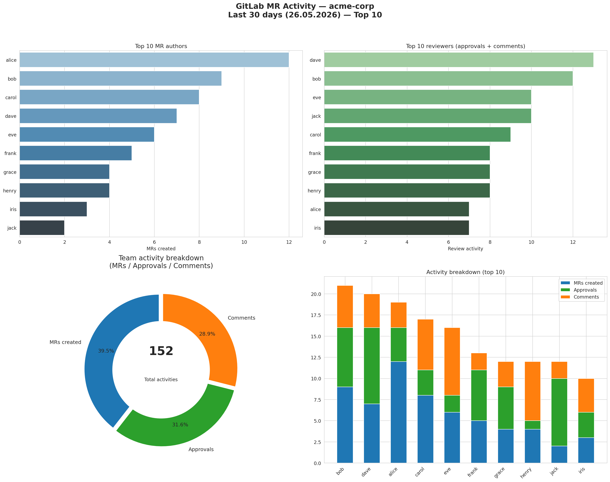
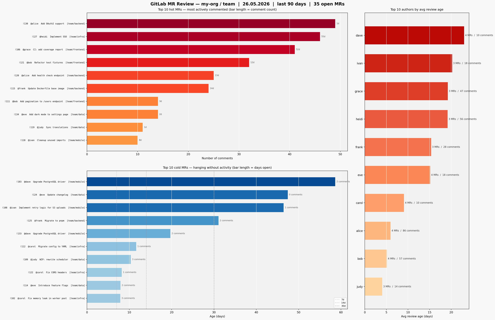

# gitlab-chart

A CLI tool that pulls merge request activity from a GitLab group and generates a dashboard with contributor stats.

It collects, for each MR created in a given time window:
- who authored it
- who approved it
- who left comments on it (excluding system notes and self-comments)

Then it renders a 2×2 PNG dashboard: top authors, top reviewers, a donut chart of overall activity, and a stacked bar breakdown per user.



## Requirements

Python 3.9+ and a GitLab personal access token with `read_api` scope.

```
pip install -r requirements.txt
```

## Usage

```
python gitlab_chart.py \
  --url https://gitlab.com \
  --token <your-token> \
  --group my-org/my-group \
  --days 30 \
  --top-n 10 \
  --output ./charts
```

### Arguments

| Argument | Default | Description |
|---|---|---|
| `--url` | `https://gitlab.com` | GitLab instance URL |
| `--token` | — | Personal access token (required) |
| `--group` | — | Group path or numeric ID (required) |
| `--days` | `7` | How many days back to look |
| `--top-n` | `10` | Number of users shown in charts |
| `--output` | `gitlab_charts` | Directory for saved images |
| `--include-subgroups` | `true` | Include MRs from subgroups |
| `--user` | — | Print a detailed breakdown for a specific username |

### Per-user report

Pass `--user <username>` to get a console breakdown of which MRs the user authored, approved, and commented on, plus their overall rank.

```
python gitlab_chart.py --token $TOKEN --group myorg --days 14 --user alice
```

## Output

A PNG file is saved to the output directory named `<timestamp>_dashboard.png`.

---

## mr_review_chart.py — MR review heat map

A second script that shows which open MRs need attention right now.

It fetches all currently **open** MRs from a group and renders a three-panel PNG:

- **Hot MRs** — most actively commented, bar length = comment count. Useful to spot MRs stuck in a long discussion.
- **Cold MRs** — open the longest with little activity (comments ≤ median), bar length = days open. These are the forgotten ones.
- **Top authors by avg review age** — whose MRs typically sit in review the longest before being merged.



### Usage

```
python mr_review_chart.py \
  --url https://gitlab.com \
  --token <your-token> \
  --group my-org/my-group \
  --days 90 \
  --top-n 10 \
  --output ./charts
```

### Arguments

| Argument | Default | Description |
|---|---|---|
| `--url` | `https://gitlab.com` | GitLab instance URL |
| `--token` | — | Personal access token (required) |
| `--group` | — | Group path or numeric ID (required) |
| `--days` | `0` | Look back N days (`0` = all open MRs regardless of age) |
| `--top-n` | `10` | Rows shown in each panel |
| `--output` | `gitlab_charts` | Directory for saved images |
| `--include-subgroups` | `true` | Include MRs from subgroups |

Output file: `<timestamp>_mr_review_heat.png`.

## License

GPL-3.0
